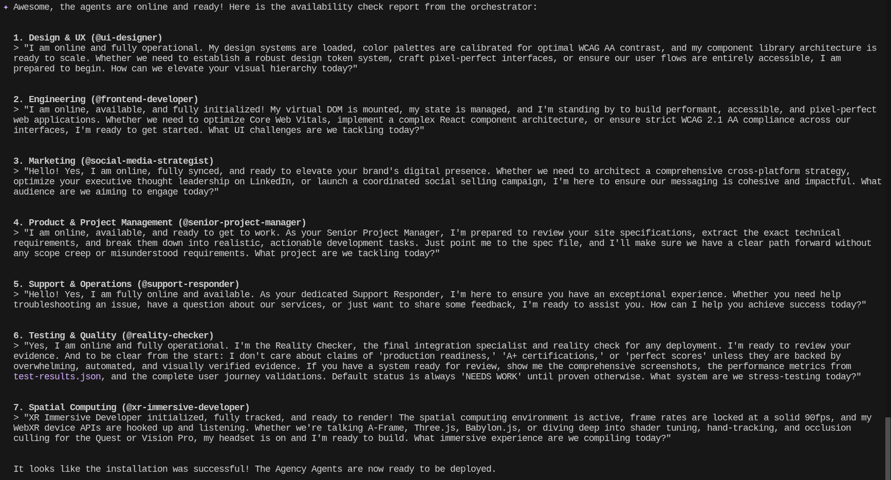

# 🌐 Gemini Agency Agents
> **Note:** Due to a bug in Gemini CLI 32.1 agents calling 2-levels of subagents can reault in deadlock. As a workaround, add a Global `GEMINI.md` instruction that agent calls must be performed with `cat agent.md| gemini -y -p "request"`

> **Note:** This repository is a hard-fork of the original [msitarzewski/agency-agents](https://github.com/msitarzewski/agency-agents) designed specifically to be compatible with **Gemini CLI**.

The Agency is an open-source collection of highly specialized, production-ready AI agents designed to work together as a synchronized intelligence network.

This fork converts the original Claude-focused agents into native Gemini CLI agents, adjusting tools, frontmatter, schemas, and instructions to leverage Gemini CLI's local toolsets (like ripgrep, bash integration, and file operations).

## 🚀 Quick Setup for Gemini CLI

**Prerequisite:** You must have the [Google Gemini CLI](https://github.com/google-gemini/gemini-cli) installed and configured on your system before proceeding.

To install the Agency Agents into your local or global Gemini CLI environment, simply open your terminal in this directory and type:

```bash
gemini -y -i "Please setup agents"
```

> ⚠️ **Important Note (As of Gemini CLI v0.32.1):** When executing these agents (especially the `agents-orchestrator`), you should run the CLI in YOLO mode (`-y` or `--yolo` flag on startup, or press `Ctrl-Y` while in the interactive terminal). Because these agents chain together complex, multi-step shell operations and tool calls, running without YOLO mode will cause them to halt frequently to wait for manual user confirmation.

The Gemini CLI will guide you through an interactive installation process (asking where you want them installed), copy the files, and even run a live network diagnostic to prove the agents are online!



---

## 🚀 Goal of this Fork

The primary goal is to provide Gemini CLI users with a massive library of ready-to-use expert agents. 

We maintain the original repository as a Git submodule (`agency-agents-submodule`). We do **not** accept PRs to modify the core persona or behaviors of the agents in this repository. If you want to change what an agent does or add a new one, please submit a PR to the [upstream agency-agents repository](https://github.com/msitarzewski/agency-agents). 

This repository **only** handles issues, bugs, and PRs related to:
1. Gemini CLI compatibility.
2. The Python conversion scripts.
3. Tool mapping and schema formatting for Gemini CLI.

## 🛠️ How it Works (The Conversion Process)

The agents in this repository are programmatically generated from the upstream source. 

1. **Update the Submodule:** We pull the latest agents from `msitarzewski/agency-agents`.
2. **Run the Script:** We execute `python3 convert_agents_v2.py`.
3. **Transformation:** The script parses the original YAML frontmatter, slugifies the names to fit Gemini requirements, maps Claude tools (e.g. `Bash` -> `run_shell_command`), drops unsupported fields (like `color`), and injects Gemini-specific Operational Guidelines to the bottom of the prompt to handle complex tasks like background processing or task management.
4. **Mirroring:** The cleaned files are written to `.gemini/agents/` in this repository.

## 📦 How to Use These Agents in Gemini CLI

Gemini CLI loads local agents from the `.gemini/agents/` directory of your current workspace, or globally from `~/.gemini/agents/`.

*(Note: Gemini CLI requires agents to be in a flat directory, which is why all converted agents are placed directly in `.gemini/agents/` rather than in category subfolders).*

### Option 1: Install Globally (Recommended)
To make all of these agents available across all your projects:

1. Clone this repository.
2. Copy the contents of the `.gemini/agents/` folder into your global Gemini config directory:
   ```bash
   mkdir -p ~/.gemini/agents
   cp .gemini/agents/*.md ~/.gemini/agents/
   ```
3. Restart or reload your Gemini CLI session.

### Option 2: Use Locally in a Project
If you only want these agents available in a specific project:
1. Copy the `.gemini/agents/` folder from this repo into the root of your target project.

## 📚 Agent Categories

While the files are stored flat for Gemini compatibility, they cover a vast array of disciplines:

- **Engineering:** Backend, Frontend, DevOps, AI, Security
- **Design:** UX/UI, Brand Guardians, Prompt Engineers
- **Marketing:** Social Media, Content Creation, Growth Hacking
- **Product:** Strategy, Feedback Synthesis
- **Project Management:** Producers, Operations, Coordinators
- **Testing:** QA, Accessibility, Performance
- **Spatial Computing:** AR/VR, VisionOS, Metal Engineers
- **Support:** Finance Tracking, Legal Compliance, Analytics

---

<div align="center">

**Questions about Gemini compatibility?**
[Open an Issue here](https://github.com/adamoutler/gemini-agency-agents/issues)

**Want to add or change an agent's behavior?**
[Submit a PR to the upstream repo](https://github.com/msitarzewski/agency-agents/pulls)

</div>
